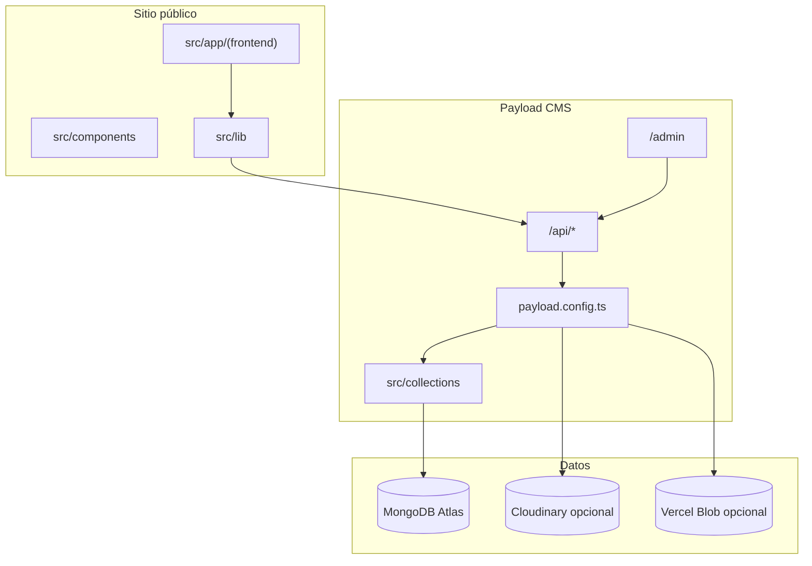

# Arquitectura

## Qué es este proyecto

E-commerce editorial de orquídeas de colección. No es un marketplace clásico: la web es una **vitrina** (catálogo, fichas, blog, guías) y el cierre de venta es por **WhatsApp**.

## Dos mundos en una sola app Next.js

Next.js 15 usa **route groups** (carpetas entre paréntesis no afectan la URL):

| Grupo | Carpeta | URL | Rol |
|-------|---------|-----|-----|
| Frontend | `src/app/(frontend)/` | `/`, `/catalog`, … | Sitio público SSR |
| Payload | `src/app/(payload)/` | `/admin`, `/api` | Panel CMS + REST |

Comparten el mismo servidor y despliegue en Vercel, pero layouts distintos:

- `(frontend)/layout.tsx` — Header, Footer, fuentes de marca, `globals.css`
- `(payload)/layout.tsx` — Layout oficial de Payload (`RootLayout`, import map)

## Flujo de una página de catálogo

1. El usuario abre `/catalog`.
2. Next ejecuta `catalog/page.tsx` (Server Component).
3. `getPayloadClient()` conecta a MongoDB.
4. `payload.find({ collection: 'products', where: { status: published } })`.
5. Cada documento se transforma con `mapProductToCard()`.
6. Se renderiza `<ProductCard />` con imagen, nombre, precio, disponibilidad.

## Archivos centrales

| Archivo | Función |
|---------|---------|
| `src/payload.config.ts` | Configuración global: DB, plugins, colecciones, CSRF, `serverURL` |
| `src/lib/payload.ts` | Cliente Payload cacheado para Server Components |
| `src/lib/env.ts` | Resuelve URL del sitio (local / Vercel / `NEXT_PUBLIC_SERVER_URL`) |
| `next.config.ts` | Integración `withPayload`, imágenes remotas (Cloudinary) |
| `vercel.json` | Comando de build y región `iad1` |

## Build de producción

El script `npm run build` hace tres cosas en orden:

1. `payload generate:importmap` — mapa del admin (componentes Payload).
2. `payload generate:types` — genera `src/payload-types.ts` (gitignored localmente; se genera en CI).
3. `next build` — compila la app.

Sin el paso 2, Vercel falla en typecheck porque `@/payload-types` no existe en el clone limpio.

## Almacenamiento de imágenes

Prioridad en `payload.config.ts`:

1. **Cloudinary** — si existen `CLOUDINARY_CLOUD_NAME`, `API_KEY`, `API_SECRET`.
2. **Vercel Blob** — si hay `BLOB_READ_WRITE_TOKEN` y no hay Cloudinary.
3. **Disco local** — carpeta `media/` en desarrollo.

Adaptador custom: `src/storage/cloudinaryAdapter.ts`.
