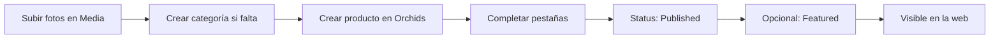

# Alta de productos en el sitio

Guía paso a paso para cargar orquídeas en **Reserva Oeste** y que aparezcan en la tienda pública.

## Resumen del flujo

| Dónde aparece | Condición |
|---------------|-----------|
| `/catalog` | `status` = **Published** |
| `/products/[slug]` | `status` = **Published** |
| Home — destacados | **Published** + **Featured** ✓ |
| WhatsApp | Botón activo si `stock` > 0 |

---

## 1. Acceder al admin

1. Abrí **https://www.reservaoeste.com.ar/admin** (o `http://localhost:3000/admin` en local).
2. Iniciá sesión con tu usuario (**admin** o **editor**).
3. Si el logout no responde: **/api/cerrar-sesion** y volvé a entrar.

---

## 2. Subir imágenes (Media)

Antes del producto, cargá las fotos en **Content → Media**.

1. Click **Create New**.
2. Subí la imagen (JPG/PNG/WebP).
3. Completá **Alt** (obligatorio) — descripción corta para accesibilidad y SEO.  
   Ejemplo: *"Cattleya blanca con labelo magenta, vista frontal"*.
4. **Caption** (opcional).
5. Guardá.

**Recomendaciones de foto (marca):**

- Luz natural, fondo limpio, planta protagonista.
- Evitar macetas plásticas llamativas o fondos de invernadero desordenados.
- Varias tomas: flor, planta entera, detalle del labelo.

Las imágenes se guardan en **Cloudinary** (producción) o en disco local / Vercel Blob según la configuración del servidor.

---

## 3. Categorías (si aún no existen)

**Catalog → Categories**

| Campo | Uso |
|-------|-----|
| Name | Nombre visible (ej. *Cattleya*, *Phalaenopsis*) |
| Slug | Se genera solo; usado en filtros del catálogo |
| Status | **Published** para que funcione el filtro |
| Short description | Texto breve (opcional en web) |

Sin al menos **una categoría publicada** no podrás publicar un producto.

---

## 4. Crear el producto

**Catalog → Orchids → Create New**

El formulario tiene **pestañas** y campos en la **barra lateral**.

### Barra lateral (importante)

| Campo | Qué hace |
|-------|----------|
| **Status** | `Draft` = solo admin · `Published` = visible en la web · `Archived` = oculto |
| **Featured** | Si está ✓ y publicado → aparece en la **home** (sección destacados) |
| **Slug** | URL amigable: `/products/tu-slug` — se genera del nombre al crear |
| **SKU** | Código interno (opcional) |

---

### Pestaña Overview (identidad y texto)

| Campo | Obligatorio | Notas |
|-------|-------------|-------|
| Name | Sí | Nombre en catálogo y ficha |
| Genus | No | Ej. *Cattleya* |
| Species | Sí | Epíteto o etiqueta principal |
| Hybrid | No | Cruce o clone |
| Categories | Sí | Al menos una |
| Short description | Sí | Máx. 280 caracteres — resumen en ficha |
| Description | Sí | Texto largo (editor Lexical) — historia del ejemplar |
| Origin | No | Origen o linaje |
| Awards | No | Premios AOS, FCC, etc. |

---

### Pestaña Commerce (precio y stock)

| Campo | Obligatorio | Notas |
|-------|-------------|-------|
| Price | Sí para publicar | Número ≥ 0 |
| Compare at price | No | Precio tachado / promoción |
| Currency | Default USD | En la web el precio se muestra con formato **ARS** (`es-AR`) — cargá el monto que quieras mostrar al cliente argentino |
| Stock | Sí para publicar | `0` = muestra **Agotado** y desactiva WhatsApp |
| Low stock threshold | No | Aviso interno en admin (default 2) |
| Availability note | No | Ej. *"Envío en 3–5 días"* |

**Disponibilidad en la tienda:**

- `stock > 0` → **Disponible** (verde botánico)
- `stock = 0` → **Agotado** — el botón de WhatsApp queda deshabilitado

---

### Pestaña Culture (cultivo)

Opcional para la web, pero recomendado para coleccionistas:

- Tamaño de planta, montaje, estación de floración
- Fragancia, dificultad (**requerido** en el formulario)
- Humedad, temperatura, luz
- Notas de riego y fertilización
- Relación opcional a una **Care Sheet**

Estos datos se muestran en la ficha del producto (`/products/[slug]`).

---

### Pestaña Media (galería)

| Campo | Obligatorio al publicar |
|-------|-------------------------|
| Gallery | **Al menos 1 imagen** |

Por cada imagen:

1. **Image** — elegí un archivo de **Media**.
2. **Caption** — opcional.
3. **Is primary** — marcá la foto principal del catálogo y hero de la ficha.  
   Si ninguna está marcada, se usa la **primera** de la lista.

---

### Pestaña SEO

| Campo | Comportamiento |
|-------|----------------|
| Meta title | Si está vacío → usa el **nombre** del producto |
| Meta description | Si está vacío → usa **short description** |
| Keywords | Opcional |
| OG image | Imagen para redes; si falta → foto principal de galería |
| No index | ✓ = Google no indexa la ficha |

---

## 5. Publicar

1. Revisá que todo esté completo según la checklist abajo.
2. En la barra lateral, cambiá **Status** a **Published**.
3. Click **Save**.

Si falta algo, Payload muestra un **error** y no guarda. Mensajes habituales:

| Error | Solución |
|-------|----------|
| *require at least one gallery image* | Pestaña Media → agregar foto |
| *require a valid price* | Commerce → Price |
| *require a valid stock count* | Commerce → Stock |
| *require at least one category* | Overview → Categories |
| *require a short description* | Overview |
| *require a full description* | Overview → Description |

Podés guardar como **Draft** en cualquier momento para ir completando sin publicar.

---

## 6. Destacar en la home

1. Producto **Published**.
2. Barra lateral → **Featured** ✓.
3. Guardar.

La home muestra hasta **6** destacados publicados, ordenados por fecha de actualización.

---

## 7. Verificar en la web

| URL | Qué comprobar |
|-----|----------------|
| `/catalog` | Tarjeta con foto, nombre, precio, Disponible/Agotado |
| `/products/[slug]` | Galería, descripción, datos de cultivo, WhatsApp |
| `/` | Si está Featured, aparece en destacados |

**WhatsApp:** requiere `NEXT_PUBLIC_WHATSAPP_NUMBER` en Vercel. El mensaje incluye nombre, precio y link al producto.

---

## 8. Editar o dar de baja

| Acción | Cómo |
|--------|------|
| Editar datos | Orchids → abrir producto → Save |
| Ocultar de la web | Status → **Draft** o **Archived** |
| Quitar de home | Desmarcar **Featured** |
| Marcar agotado | Stock → `0` (sigue visible como Agotado) |

---

## Checklist rápida antes de publicar

- [ ] Fotos en Media con **Alt**
- [ ] Al menos **1 categoría** publicada asignada
- [ ] Nombre, species, short description, description
- [ ] Price y stock
- [ ] Galería con ≥ 1 imagen
- [ ] Dificultad (Culture)
- [ ] Status → **Published**
- [ ] (Opcional) Featured para home

---

## Roles

| Rol | Puede cargar productos | Puede publicar |
|-----|------------------------|----------------|
| **editor** | Sí | Sí |
| **admin** | Sí | Sí + gestionar usuarios |

---

## Problemas frecuentes

**El producto no aparece en el catálogo**  
→ Verificá `status: Published` y que MongoDB esté conectado en producción.

**La imagen no se ve**  
→ Revisá que Media tenga URL válida (Cloudinary configurado en Vercel).

**El precio se ve raro**  
→ El sitio formatea en pesos argentinos; el campo Currency del admin es referencia interna.

**Error al guardar**  
→ Leé el mensaje rojo del admin; casi siempre falta un campo obligatorio de publicación.

---

## Referencia técnica

| Qué | Dónde en el código |
|-----|-------------------|
| Modelo de producto | `src/collections/Products.ts` |
| Validación al publicar | `src/collections/products/hooks.ts` |
| Tarjeta de catálogo | `src/components/products/ProductCard.tsx` |
| Página de ficha | `src/app/(frontend)/products/[slug]/page.tsx` |
| Filtros catálogo | `src/app/(frontend)/catalog/page.tsx` |
